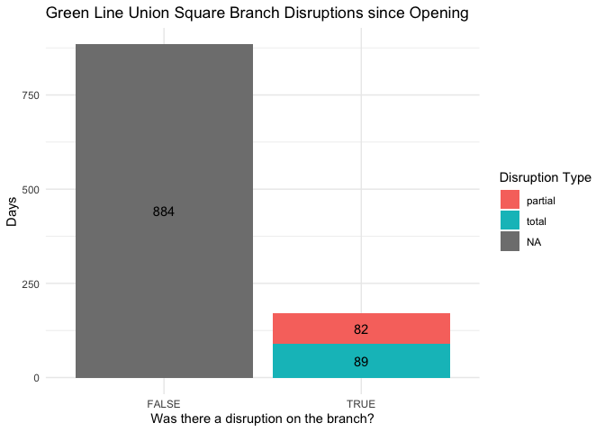
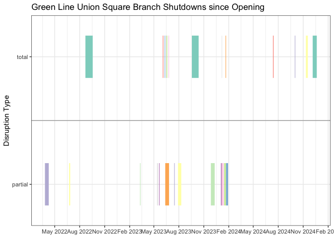

# GLX Union Square Branch
Seamus Joyce-Johnson
2024-12-09

# Introduction

The Union Square branch of the MBTA Green Line Extension (GLX) opened on
March 21, 2022 and has been repeatedly disrupted since then. For this
project, we focus on major disruptions, rather than incedental
interruptions in daily service. Most of these disruptions have been
planned ahead by the MBTA, but still cause major headaches for riders.

# Recording the Shutdowns

We classify disruptions to the Union Square branch into two categories,
`total` and `partial`:

- `total` shutdowns occur on dates where there is no service to Union
  Square station.
- `partial` shutdowns occur on dates where the Green Line’s trunk is
  shut down (i.e. between Lechmere and Kenmore), which typically results
  in significantly worse headways on the Union Square branch.

We do not include shutdowns to other branches (e.g. Riverside) because
the MBTA is typically able to provide normal service to the Union Square
branch during those disruptions.

> As a proof of concept, we manually input the shutdowns since the
> opening of the Union Square branch, based on MBTA press releases,
> Twitter service alerts, and news articles. In the future, we hope to
> automatically detect disruptions from the MBTA’s published historical
> trip data and dynamically generate the visualizations below.

<details class="code-fold">
<summary>Show shutdown input code</summary>

``` r
# note: using POSIXct because Date objects gave weird behavior with vistime
#       when shutdown was just one day long

shutdown_data <- data.frame(
  name = character(),
  startDate = as.POSIXct(character()),
  endDate = as.POSIXct(character()),
  status = character(),
  stringsAsFactors = FALSE
)

add_shutdown <- function(sd_name,start_date, end_date, status) {
  new_row <- data.frame(name = sd_name,
                        startDate = ymd_hm(paste0(start_date,"00:01")),
                        endDate = ymd_hm(paste0(end_date,"23:59")),
                        status = status,
                        stringsAsFactors = FALSE)
  shutdown_data <<- rbind(shutdown_data, new_row)
  df[df$date >= as.POSIXct(start_date) & df$date <= as.POSIXct(end_date),]$status <<- status
}

# Adding shutdown periods and statuses to the dataframe

## "Final" speed restriction elimination shutdown
add_shutdown("Speed restriction elimination","2024-12-06","2024-12-20","total")

## "Track work" (related to derailment?)
add_shutdown("Track work","2024-11-11","2024-11-17","total")

## Red Bridge derailment
add_shutdown("Red Bridge derailment","2024-10-01","2024-10-02","total")

## Track work on the Lechmere viaduct to prevent head-related speed restrictions
## (Wait, didn't we just work on the viaduct for years?)
add_shutdown("Track work","2024-07-13","2024-07-14","total")

## More "track work" shutting down the downtown core (Kenmore-North Station)
## https://twitter.com/MBTA/status/1737971366895182008
## https://twitter.com/MBTA/status/1743275985145823461
add_shutdown("Track work","2024-01-22","2024-01-28","partial")
add_shutdown("Track work","2024-01-20","2024-01-21","total")
add_shutdown("Track work","2024-01-16","2024-01-19","partial")
add_shutdown("Track work","2024-01-07","2024-01-12","partial")
add_shutdown("Track work","2024-01-06","2024-01-06","total")
add_shutdown("Track work","2024-01-03","2024-01-05","partial")

## Eng's speed restriction elimination program
## https://www.mbta.com/news/2023-11-16/december-service-changes-will-allow-crews-continue-improvement-work-across-mbta
add_shutdown("Speed restriction elimination","2023-11-27", "2023-12-10", "partial")

## Twelfth Government Center shutdown & Squires Bridge repair work
## https://www.mbta.com/news/2023-09-19/october-service-changes-will-allow-crews-continue-improvement-work-across-mbta
add_shutdown("GC12 and Squires Bridge","2023-09-18", "2023-10-12", "total")

## Eleventh Government Center shutdown
## https://www.mbta.com/news/2023-07-27/reminder-12-day-service-change-orange-and-green-lines-government-center-garage-work
add_shutdown("GC11","2023-07-29", "2023-08-09", "partial")

## July 2023 safety inspection
## https://www.mbta.com/news/2023-06-29/july-service-changes-will-allow-crews-continue-track-improvement-work-across-mbta
add_shutdown("Safety inspection","2023-07-15", "2023-07-16", "partial")

## Sixth through Tenth Government Center shutdowns
## https://www.mbta.com/news/2023-05-25/june-service-changes-will-allow-crews-continue-track-improvement-work-across-mbta
## https://www.mbta.com/news/2023-06-09/additional-service-changes-june-provide-crews-rail-access-continue-track-work
add_shutdown("GC6","2023-06-03", "2023-06-04", "total")
add_shutdown("GC7","2023-06-10", "2023-06-11", "total")
add_shutdown("GC8","2023-06-12", "2023-06-25", "partial")
add_shutdown("GC9","2023-06-17", "2023-06-18", "total")
add_shutdown("GC10","2023-06-24", "2023-06-25", "total")

## Fourth and Fifth Government Center shutdowns
## https://www.mbta.com/news/2023-04-24/may-service-changes-will-allow-crews-continue-track-improvement-work-across-mbta
add_shutdown("GC4","2023-05-13", "2023-05-14", "partial")
add_shutdown("GC5","2023-05-20", "2023-05-21", "partial")

## Third Government Center shutdown
## https://www.bostonglobe.com/2023/02/15/metro/mbta-service-disruptions-coming-red-mattapan-orange-green-lines-commuter-rail-march/
add_shutdown("GC3","2023-03-11", "2023-03-12", "partial")

## August-September 2022 shutdown
## "MBTA officials said the shutdown between the Green Line’s Government Center and Union Square stations is necessary to complete work on the Medford branch and continue work at the Government Center garage, which is being demolished by the developer of the $1.3 billion One Congress office tower. The shutdown begins Aug. 22."
## "During the partial Green Line closure, the MBTA expects to eliminate a speed restriction on the viaduct and integrate track switches, power lines, signal equipment, and digital equipment connecting the Union Square and Medford branches to the MBTA’s control center."
## https://www.bostonglobe.com/2022/08/05/metro/mbta-close-newly-opened-green-line-extension-4-weeks/
add_shutdown("Medford","2022-08-22", "2022-09-17", "total")

## Second Government Center shutdown
## https://www.wcvb.com/article/mbta-service-goals-government-center-garage-safety-concerns-service-resumes/40429573
add_shutdown("GC2","2022-06-23", "2022-06-26", "partial")

## Government Center Garage collapse
## https://www.nbcboston.com/news/local/mbta-green-line-service-between-north-station-and-government-center-resumes/2690031/
add_shutdown("Government Center Garage collapse","2022-03-26", "2022-04-08", "partial")
```

</details>

# Shutdowns Visualizations





# Percent Uptime

Out of all the days since the Union Square branch opened, for what
percent has it been fully operational?

``` r
# get df without buffer into the future
df_no_future <- df |>
  filter(date <= Sys.Date())

pct_uptime = sum(is.na(df_no_future$status)) / nrow(df_no_future)
pct_uptime_incl_partial = sum(is.na(df_no_future$status) | 
                                df_no_future$status != "total") /
  nrow(df_no_future)
```

Including both total and partial shutdowns, the Union Square branch’s
uptime has been 83.9% since opening. If only total shutdowns are
considered, the uptime is 92.2%.

# Shutdown Detection

Can we use MBTA historical trip data to detect shutdowns, without having
to input them manually?

``` r
# WORK IN PROGRESS
events <- read.csv("/Users/seamus/Downloads/Events_2023/2023-06_LREvents.csv") # using June as test data

# direction 1 is northbound, 0 is southbound

# use D branch 
lech_arr <- events[(events$stop_id == "70500" | events$stop_id == "70501" | events$stop_id == "70502")
                   & events$event_type == "ARR"
                   & events$route_id == "Green-D"
                   & events$direction_id == 0 # southbound
                   ,]
table(lech_arr$service_date)

# detect shutdowns
dates_month <- data.frame(date = (seq(as.Date("2023-06-01"),as.Date("2023-06-30"),"days")))
tripsPerDay <- as.data.frame(table(lech_arr$service_date)) %>%
  mutate(date = as.Date(Var1)) %>%
  complete(date = dates_month$date) %>%
  select(-Var1) %>%
  rename(trips = Freq) %>%
  replace(is.na(.),0)

dates_shut_down_month <- filter(tripsPerDay,trips<10)
```
