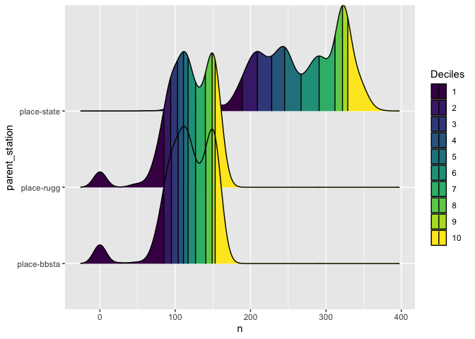
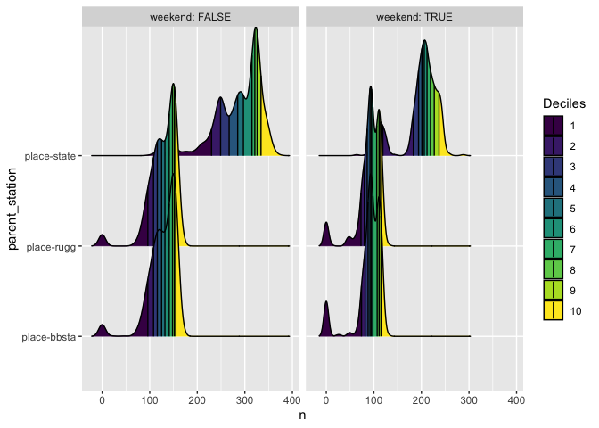

# GLX Union Square Branch
Seamus Joyce-Johnson
2024-12-10

# Introduction

The Union Square branch of the MBTA Green Line Extension (GLX) opened on
March 21, 2022 and has been repeatedly disrupted since then. For this
project, we focus on major disruptions, rather than incedental
interruptions in daily service. Most of these disruptions have been
planned ahead by the MBTA, but still cause major headaches for riders.

# Recording the Shutdowns

We classify disruptions to the Union Square branch into two categories,
`total` and `partial`:

- `total` shutdowns occur on dates where there is no service to Union
  Square station.
- `partial` shutdowns occur on dates where the Green Line’s trunk is
  shut down (i.e. between Lechmere and Kenmore), which typically results
  in significantly worse headways on the Union Square branch.

We do not include shutdowns to other branches (e.g. Riverside) because
the MBTA is typically able to provide normal service to the Union Square
branch during those disruptions.

> As a proof of concept, we manually input the shutdowns since the
> opening of the Union Square branch, based on MBTA press releases,
> Twitter service alerts, and news articles. In the future, we hope to
> automatically detect disruptions from the MBTA’s published historical
> trip data and dynamically generate the visualizations below.

<details class="code-fold">
<summary>Show shutdown input code</summary>

``` r
# note: using POSIXct because Date objects gave weird behavior with vistime
#       when shutdown was just one day long

shutdown_data <- data.frame(
  name = character(),
  startDate = as.POSIXct(character()),
  endDate = as.POSIXct(character()),
  status = character(),
  stringsAsFactors = FALSE
)

add_shutdown <- function(sd_name,start_date, end_date, status) {
  new_row <- data.frame(name = sd_name,
                        startDate = ymd_hm(paste0(start_date,"00:01")),
                        endDate = ymd_hm(paste0(end_date,"23:59")),
                        status = status,
                        stringsAsFactors = FALSE)
  shutdown_data <<- rbind(shutdown_data, new_row)
  df[df$date >= as.POSIXct(start_date) & df$date <= as.POSIXct(end_date),]$status <<- status
}

# Adding shutdown periods and statuses to the dataframe

## "Final" speed restriction elimination shutdown
add_shutdown("Speed restriction elimination","2024-12-06","2024-12-20","total")

## "Track work" (related to derailment?)
add_shutdown("Track work","2024-11-11","2024-11-17","total")

## Red Bridge derailment
add_shutdown("Red Bridge derailment","2024-10-01","2024-10-02","total")

## Track work on the Lechmere viaduct to prevent head-related speed restrictions
## (Wait, didn't we just work on the viaduct for years?)
add_shutdown("Track work","2024-07-13","2024-07-14","total")

## More "track work" shutting down the downtown core (Kenmore-North Station)
## https://twitter.com/MBTA/status/1737971366895182008
## https://twitter.com/MBTA/status/1743275985145823461
add_shutdown("Track work","2024-01-22","2024-01-28","partial")
add_shutdown("Track work","2024-01-20","2024-01-21","total")
add_shutdown("Track work","2024-01-16","2024-01-19","partial")
add_shutdown("Track work","2024-01-07","2024-01-12","partial")
add_shutdown("Track work","2024-01-06","2024-01-06","total")
add_shutdown("Track work","2024-01-03","2024-01-05","partial")

## Eng's speed restriction elimination program
## https://www.mbta.com/news/2023-11-16/december-service-changes-will-allow-crews-continue-improvement-work-across-mbta
add_shutdown("Speed restriction elimination","2023-11-27", "2023-12-10", "partial")

## Twelfth Government Center shutdown & Squires Bridge repair work
## https://www.mbta.com/news/2023-09-19/october-service-changes-will-allow-crews-continue-improvement-work-across-mbta
add_shutdown("GC12 and Squires Bridge","2023-09-18", "2023-10-12", "total")

## Eleventh Government Center shutdown
## https://www.mbta.com/news/2023-07-27/reminder-12-day-service-change-orange-and-green-lines-government-center-garage-work
add_shutdown("GC11","2023-07-29", "2023-08-09", "partial")

## July 2023 safety inspection
## https://www.mbta.com/news/2023-06-29/july-service-changes-will-allow-crews-continue-track-improvement-work-across-mbta
add_shutdown("Safety inspection","2023-07-15", "2023-07-16", "partial")

## Sixth through Tenth Government Center shutdowns
## https://www.mbta.com/news/2023-05-25/june-service-changes-will-allow-crews-continue-track-improvement-work-across-mbta
## https://www.mbta.com/news/2023-06-09/additional-service-changes-june-provide-crews-rail-access-continue-track-work
add_shutdown("GC6","2023-06-03", "2023-06-04", "total")
add_shutdown("GC7","2023-06-10", "2023-06-11", "total")
add_shutdown("GC8","2023-06-12", "2023-06-25", "partial")
add_shutdown("GC9","2023-06-17", "2023-06-18", "total")
add_shutdown("GC10","2023-06-24", "2023-06-25", "total")

## Fourth and Fifth Government Center shutdowns
## https://www.mbta.com/news/2023-04-24/may-service-changes-will-allow-crews-continue-track-improvement-work-across-mbta
add_shutdown("GC4","2023-05-13", "2023-05-14", "partial")
add_shutdown("GC5","2023-05-20", "2023-05-21", "partial")

## Third Government Center shutdown
## https://www.bostonglobe.com/2023/02/15/metro/mbta-service-disruptions-coming-red-mattapan-orange-green-lines-commuter-rail-march/
add_shutdown("GC3","2023-03-11", "2023-03-12", "partial")

## August-September 2022 shutdown
## "MBTA officials said the shutdown between the Green Line’s Government Center and Union Square stations is necessary to complete work on the Medford branch and continue work at the Government Center garage, which is being demolished by the developer of the $1.3 billion One Congress office tower. The shutdown begins Aug. 22."
## "During the partial Green Line closure, the MBTA expects to eliminate a speed restriction on the viaduct and integrate track switches, power lines, signal equipment, and digital equipment connecting the Union Square and Medford branches to the MBTA’s control center."
## https://www.bostonglobe.com/2022/08/05/metro/mbta-close-newly-opened-green-line-extension-4-weeks/
add_shutdown("Medford","2022-08-22", "2022-09-17", "total")

## Second Government Center shutdown
## https://www.wcvb.com/article/mbta-service-goals-government-center-garage-safety-concerns-service-resumes/40429573
add_shutdown("GC2","2022-06-23", "2022-06-26", "partial")

## Government Center Garage collapse
## https://www.nbcboston.com/news/local/mbta-green-line-service-between-north-station-and-government-center-resumes/2690031/
add_shutdown("Government Center Garage collapse","2022-03-26", "2022-04-08", "partial")
```

</details>

# Shutdowns Visualizations


# Percent Uptime

Out of all the days since the Union Square branch opened, for what
percent has it been fully operational?

``` r
# get df without buffer into the future
df_no_future <- df |>
  filter(date <= Sys.Date())

pct_uptime = sum(is.na(df_no_future$status)) / nrow(df_no_future)
pct_uptime_incl_partial = sum(is.na(df_no_future$status) | 
                                df_no_future$status != "total") /
  nrow(df_no_future)
```

Including both total and partial shutdowns, the Union Square branch’s
uptime has been 83.8% since opening. If only total shutdowns are
considered, the uptime is 92.1%.

# Shutdown Detection

Can we use MBTA historical trip data to detect shutdowns, without having
to input them manually?

The T has moved to [LAMP](https://performancedata.mbta.com/) for storing
performance data in a more developer-friendly format. By summarizing the
number of trips per day at each rapid transit station, we can detect
shutdowns by extracting days with significantly fewer trips than usual.

Using `purrr::map`, this took 10 minutes on my laptop for ~ 5 years of
data. `purrr:pmap_dfr` (parallel) got it down to 5 minutes.

This method could be faster if we could use `arrow::open_dataset()` to
read the data as a queryable table, but we can’t use this function
without access to the LAMP performance data root directory.

``` r
lamp_index <- read_csv("https://performancedata.mbta.com/lamp/subway-on-time-performance-v1/index.csv")
```

    Rows: 1914 Columns: 4
    ── Column specification ────────────────────────────────────────────────────────
    Delimiter: ","
    chr  (1): file_url
    dbl  (1): size_bytes
    dttm (1): last_modified
    date (1): service_date

    ℹ Use `spec()` to retrieve the full column specification for this data.
    ℹ Specify the column types or set `show_col_types = FALSE` to quiet this message.

``` r
# Function to process each row of lamp_index
process_file <- function(service_date, file_url) {
  # Print the current progress (service date being processed)
  # message("Processing service date: ", service_date)
  
  # Try to read and process the parquet file
  tryCatch({
    # Read the parquet file into a tibble
    df <- arrow::read_parquet(file_url)
    
    # Summarize by counting parent_station and direction_id, add service_date
    summary <- df |>
      count(parent_station, direction_id) |>
      mutate(service_date = service_date)
    
    return(summary)
    
  }, error = function(e) {
    message("Error processing ", file_url, ": ", e$message)
    return(NULL)
  })
}
```

``` r
# Measure the execution time for the entire process
# should take on the order of 5 minutes
# can uncomment progress message in function definition if desired 
execution_time <- system.time({
  lamp_stations_summary <- lamp_index |>
    select(service_date, file_url) |> # only pass necessary columns
    pmap_dfr(process_file) |> # execute summarization of LAMP data (BIG)
    # create entries for days with 0 service
    complete(service_date, parent_station, direction_id, fill = list(n = 0))
})

# Print the df and total execution time
print(paste("Total execution time:", execution_time["elapsed"], "seconds"))

tail(lamp_stations_summary)

## appears to be somewhat messy, with changing parent_station and stop_id names
## there should be 125 non-Silver Line MBTA Rapid Transit stations
## based on https://www.mass.gov/info-details/massgis-data-mbta-rapid-transit
## TODO: clean up
```

Here’s an attempt to manually construct an Arrow dataset. H/t
https://github.com/apache/arrow/issues/44992#issuecomment-2532636356.

``` r
# First we need to get the list of files
file_url_prefix <- "https://performancedata.mbta.com/lamp/subway-on-time-performance-v1/"
index_csv_url <- paste0(file_url_prefix, "index.csv")

index_tbl <- read_csv_arrow(index_csv_url) 
index_tbl$relpath <- str_remove_all(index_tbl$file_url, file_url_prefix)

# Then, to create a Dataset manually, we need to create a Filesystem first
# Since we don't support HTTP filesystems but this dataset is backed by S3-like
# storage, we can create a custom S3 Filesystem and still use our S3 driver
fs <- S3FileSystem$create(
  anonymous = TRUE, 
  endpoint_override = "https://performancedata.mbta.com"
)
# cd into the right path
ds_fs <- fs$cd("lamp/subway-on-time-performance-v1")

dsf <- FileSystemDatasetFactory$create(
  filesystem = ds_fs, 
  paths = index_tbl$relpath, 
  format = FileFormat$create("parquet"),
)
ds <- dsf$Finish()

# Now we can use the Dataset as normal
ds |> 
  head() |> 
  collect()
```

    # A tibble: 6 × 27
      stop_sequence stop_id      parent_station move_timestamp stop_timestamp
              <int> <chr>        <chr>                   <int>          <int>
    1             1 Oak Grove-01 place-ogmnl                NA     1568643555
    2             1 70210        place-lech         1568643599             NA
    3           120 70095        place-jfk                  NA     1568643680
    4           650 70209        place-lech                 NA     1568643698
    5             1 Alewife-02   place-alfcl                NA     1568643730
    6           310 70107        place-lake                 NA     1568643731
    # ℹ 22 more variables: travel_time_seconds <int>, dwell_time_seconds <int>,
    #   headway_trunk_seconds <int>, headway_branch_seconds <int>,
    #   service_date <int>, route_id <chr>, direction_id <lgl>, start_time <int>,
    #   vehicle_id <chr>, branch_route_id <chr>, trunk_route_id <chr>,
    #   stop_count <int>, trip_id <chr>, vehicle_label <chr>,
    #   vehicle_consist <chr>, direction <chr>, direction_destination <chr>,
    #   scheduled_arrival_time <int>, scheduled_departure_time <int>, …

``` r
execution_time_ds <- system.time({
  lamp_stations_summary <- ds |>
    count(parent_station, direction_id, service_date) |>
    collect() |>
    mutate(service_date = as.Date(as.character(service_date), "%Y%m%d")) |>
    # mutate(parent_station = case_when(parent_station %in% c(70138)))
    complete(service_date, parent_station, direction_id, fill = list(n = 0))
})

# Print the total execution time
print(paste("Total execution time:", execution_time_ds["elapsed"], "seconds"))
```

    [1] "Total execution time: 41.004 seconds"

``` r
# note missing stations:
## 70138 and 70139 were old Pleasant St station on B branch,
## closed at end of service on 2021-02-26
## 70207 and 70208 were old Science Park/West End Green Line
## 70209 was old Lechmere (exit only)
## 71199 is Park St Green Line (drop off only)
# also, weirdly, there's no Union Square data until 2022-09-28
# TODO: clean data to reflect these (and station opening/closing dates)
```

We can visualize the distribution of trips per day at some stations to
get a sense of what kind of cutoff we might need for declaring that a
given station was shut down.

``` r
# plot some stations on the Orange Line
library(ggridges)
lamp_stations_summary |>
  filter(parent_station %in% c("place-rugg","place-bbsta","place-state") &
           direction_id == T) |>
  ggplot(aes(x = n, y = parent_station, fill = factor(after_stat(quantile)))) +
    stat_density_ridges(geom = "density_ridges_gradient", quantiles = 10,
                        quantile_lines = T, calc_ecdf = T) +
    scale_fill_viridis_d(name = "Deciles")
```

    Picking joint bandwidth of 8.45



``` r
lamp_stations_summary_shutdown <- lamp_stations_summary |>
  group_by(parent_station, direction_id) |>
  mutate(closed = n < quantile(n, 0.01, na.rm = TRUE)) |>
  ungroup()

# TODO: determine appropriate percentile cutoff
# probably need to group data by stop_id to account for shutdowns of a
# single line at a transfer station
# also should probably add a weekend flag to get a tighter distribution
# for each stop
# mutate(weekend = wday(service_date) %in% c(1, 7))
```

We may get tighter distributions if we isolate weekdays from weekends.

``` r
lamp_stations_summary |>
  mutate(weekend = wday(service_date) %in% c(1, 7)) |>
  filter(parent_station %in% c("place-rugg","place-bbsta","place-state") &
           direction_id == T) |>
  ggplot(aes(x = n, y = parent_station, fill = factor(after_stat(quantile)))) +
    stat_density_ridges(geom = "density_ridges_gradient", quantiles = 10,
                        quantile_lines = T, calc_ecdf = T) +
    scale_fill_viridis_d(name = "Deciles") +
  facet_wrap(vars(weekend), labeller = "label_both")
```

    Picking joint bandwidth of 7.33

    Picking joint bandwidth of 4.97



``` r
# Union Square example
# note have to handle union square only counts in one direction as a terminal
usq_shutdown_dates <- lamp_stations_summary |>
  group_by(service_date, parent_station) |>
  summarise(n = sum(n)) |>
  filter(parent_station == "place-unsqu" & n < 10) %>%
  select(service_date, n) |>
  distinct() |>
  filter(service_date >= as.Date("2022-03-21")) # only dates after opening
```

    `summarise()` has grouped output by 'service_date'. You can override using the
    `.groups` argument.

``` r
tail(usq_shutdown_dates)
```

    # A tibble: 6 × 2
    # Groups:   service_date [6]
      service_date     n
      <date>       <int>
    1 2024-11-17       0
    2 2024-12-06       0
    3 2024-12-07       0
    4 2024-12-08       0
    5 2024-12-09       0
    6 2024-12-10       0
